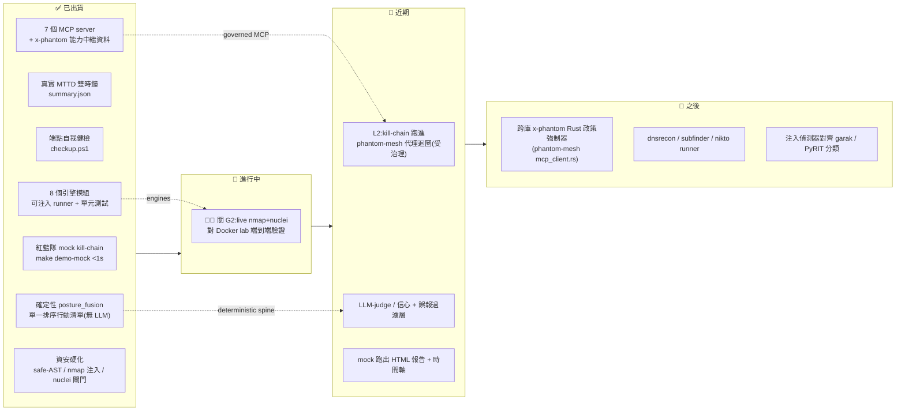

> ARCHIVED 2026-06-19 — 內容已併入 docs/phantom-secops.md;此為歷史版本。

# 🗺️ phantom-secops 開發藍圖（繁體中文 · 視覺化）

> 🤖 **一行定位**：在 [phantom-mesh](https://github.com/markl-a/phantom-mesh) 多代理執行階段上的
> **唯讀、純文字、受治理的資安維運大腦** —— 包兩件事:① 紅藍隊 SOC 概念展示(以 **MTTD 平均偵測時間** 對照),
> ② 本機優先的端點自我健檢工具(主機姿態 / 相依套件 CVE / 主機入侵偵測,由 LLM 統整成一份優先級行動清單)。
>
> 🛡️ **護城河(永久不變的界線)**:**唯讀 / 純文字輸出** + **受治理的 MCP 編排**(`x-phantom` 能力模型 +
> phantom-mesh governor / 手機核可)+ **LLM 只當 triager / judge,絕不當 exploiter**。
> 哲學一句話:*「不造引擎,造大腦」* —— 包裝成熟工具,讓 LLM 編排、關聯、解釋。
>
> 📖 **真相來源是英文版 [`ROADMAP.md`](ROADMAP.md)**(以 `main` 上已合併 commit 為準)。
> 本文件是它的繁中視覺化導覽;狀態如有出入,以英文版為準。
> 方向依據:[`docs/OSS-LANDSCAPE-AND-DIRECTION.md`](docs/OSS-LANDSCAPE-AND-DIRECTION.md)。

---

## 🔣 圖例(emoji 速掃)

| 符號 | 意義 |
|---|---|
| ✅ | 已出貨(在 `main` 上,有測試/可跑) |
| 🚧 | 進行中(現在的硬化里程碑) |
| 📅 | 近期(下一步,已有設計或明確路徑) |
| 🔭 | 之後(方向已定,尚未開工) |
| ⛔ | 刻意不做 / 倫理紅線(永久界線,非未來工作) |
| 🔴 | 高優先 |
| 🧪 | 需真實環境驗證 |
| 👤 | 需操作者決策 |

---

## ② Mermaid 狀態流

---

## ③ 分期表(grounded;每階段 2–4 項)

> 機台:`orchestrator node (Win)`(主力 Windows 開發機)、`Win node A`(Windows 驗證節點)、`Win node B`、`a Mac node`。
> AI:`codex`(逐檔機械式編修/codegen)、`opencode`(讀庫/綜整)、`agy`(Q&A/第二意見)、
> `claude`(編排 + 對抗式驗證 + 最終判斷)。單人多機;排序 = 便宜高值先 → 護城河先 → 需真環境/操作者決策後。

### 🚧 階段 0 — 可信度(現在)

| 目標 | 具體項 | 在哪台機 + 哪個 AI 做 | 風險 / 前置 |
|---|---|---|---|
| 🔴🧪 **關 G2:讓頭號展示是真的** | live `nmap` recon + 逐端點 `nuclei` vuln-scan 對 Docker lab **端到端**驗證(程式已接,尚未驗) | `orchestrator node (Win)`(有 Docker/WSL)跑 lab;`claude` 編排 + `codex` 修接線缺口;`agy` 第二意見 | 🧪 需 `make lab-up`(Docker lab 真的起來);nuclei 首跑在 lab 容器內自安裝 |
| 維持唯讀不變式 | 在測試中斷言 `has_runnable_poc == false` 為永久不變式 | `orchestrator node (Win)` + `codex` 寫測試 | 低;純測試 |

### 📅 階段 1 — 受治理的代理迴圈(Pillar 1 L2)

| 目標 | 具體項 | 在哪台機 + 哪個 AI 做 | 風險 / 前置 |
|---|---|---|---|
| 👤 **把 kill-chain 跑進 phantom-mesh 代理** | 今日是確定性 Python orchestrator(`scenarios/run_kill_chain.py`)驅動;改由 phantom-mesh 代理迴圈驅動,**外面包 governor + 手機核可** | `orchestrator node (Win)` 為主 + `claude` 編排;`codex` 寫 `secops_mcp/` façade(設計見 `docs/L2-INTEGRATION-PLAN.md`,**尚未建**) | 👤 需確認治理界線;前置 = 階段 0 的 live 路徑可信 |
| 用 `x-phantom` 真正擋工具 | blue 代理被拒用 red 工具(能力模型從「廣告」變「強制」) | `orchestrator node (Win)` + `codex`;`opencode` 對讀 MCP 中繼資料 | MCP 本身是攻擊面(工具下毒/越權),強制需可靠 |

### 🔭 階段 2 — LLM-judge / triage 層

| 目標 | 具體項 | 在哪台機 + 哪個 AI 做 | 風險 / 前置 |
|---|---|---|---|
| 在 fused 發現上加判官 | 信心分數 + 誤報過濾 judge(對齊 Semgrep Assistant / Corgea 的「引擎找事實、LLM 分級」模式);`posture_fusion` 確定性核心保持不變 | `orchestrator node (Win)` + `claude` 設計 judge prompt;`codex` 實作;`agy`/`opencode` 雙閘 review | 須守住「確定性脊椎」不被 LLM 取代 |
| 視覺化 | mock 跑出 HTML 報告 + 時間軸(供圖表消費者) | `a Windows node` 或 `orchestrator node (Win)` + `codex` | 低;純展示層 |

### 🔭 階段 3 — 跨庫政策強制器 + 注入分類對齊

| 目標 | 具體項 | 在哪台機 + 哪個 AI 做 | 風險 / 前置 |
|---|---|---|---|
| 🛡️ **護城河:跨庫 `x-phantom` 強制器** | 在 phantom-mesh `mcp_client.rs` 落地 Rust 政策強制器(把 phantom-secops 從展示變成「任何 MCP 資安工具都能用的治理範式」) | `orchestrator node (Win)`(Rust 主庫)+ `claude` 編排;`codex` 寫 Rust;`agy` review | 跨庫;需 phantom-mesh 端協調 |
| 對齊業界分類 | 注入偵測器規則對齊 garak / PyRIT 分類(**引用不重造**) | `orchestrator node (Win)` + `opencode` 查分類 → `codex` 套用 | 低;引用既有 taxonomy |
| 補概念 runner | `dnsrecon` / `subfinder` / `nikto`(目前只在圖中;nikto 已裝在 lab image 未被呼叫) | `a Windows node` + `codex` | 需 lab 環境;優先級低於護城河 |

---

## ④ 刻意不做 / over-build / 倫理紅線

> 這些是**永久界線,不是未來工作**(見 [`ETHICS.md`](ETHICS.md) 與 [`docs/DECISIONS.md`](docs/DECISIONS.md))。
> 任何要加入下列項目的 PR,依憲章視為 out-of-scope。

| ⛔ 紅線 | 為什麼不做 |
|---|---|
| ⛔ **不加可執行 PoC / exploit** | `has_runnable_poc` 永遠為 `false`,suggester 只吐**散文**。違反唯讀/純文字憲章;且踩 CFAA/授權法律風險。這條線**就是產品**,不是限制。 |
| ⛔ **不做外部掃描** | lab 目標在 localhost / Docker overlay 以外全數**拒絕清單**;端點工具唯讀且僅限本機。對外掃描 = 法律風險 + 失去利基。 |
| ⛔ **不自動修復(auto-remediation)** | 每個工具只**建議**,絕不改你的系統。保持低信任/低責任門檻;誤改即災難。 |
| ⛔ **不漂向自主化(autonomy drift)** | OSS 攻擊代理(Strix 26k★、CAI 9.2k★、PentAGI 14.7k★)全在衝「全自主 exploit」。每往那走一步就**抹掉**本專案利基、**加上**法律面。不追「自主 pentester」。 |
| ⛔ **不蹭「自主找 0-day」頭條** | Big Sleep / OSS-Fuzz-Gen / XBOW 是**前沿實驗室 + 重算力**結果,不是單人 Apache 專案該設的目標。誠實設定期待。 |
| ⛔ **不重造掃描引擎** | 包裝 Trivy / Nmap / Nuclei / Sigma 當引擎即可;不重寫 scanner。 |
| ⚠️ **AGPL Vulnhuntr 只參考、不 vendor** | 本庫 Apache-2.0;Vulnhuntr 是 **AGPL-3.0**。可引用其思路,**不可** vendor / 衍生其程式碼,否則授權立場破功。 |
| ⚠️ **MTTD / demo 數字在 mock 模式須標「simulated」** | 已落實。這份誠實是相對於市場過度宣稱端的可信度護城河。 |

### 🧭 OSS 選型(標「候選方向」)

| 決策 | 項目 |
|---|---|
| ✅ **包裝為引擎(已做 / 續用)** | Trivy(CVE)、Nmap、Nuclei、Sigma(偵測規則)。**候選方向**:garak / promptfoo / PyRIT 作為注入偵測器的**選用** LLM-red-team 檢查。 |
| 📖 **只引用 / 致敬(不建)** | Vulnhuntr(AGPL,僅參考)/ Big Sleep / Aardvark / OSS-Fuzz-Gen(前沿 0-day 發掘,明確 out-of-scope);Semgrep Assistant、Corgea 作為「引擎 + AI triage」先例佐證設計。 |
| 🛠️ **要建(差異化部分)** | ① 跨庫 `x-phantom` 政策強制器;② findings 上的 LLM-judge / 信心 + 誤報過濾層;③ posture-fusion 深化;④ 受 governor + 手機核可包裹的代理迴圈(Pillar 1 L2),非放任自走。 |

---

> 🔁 本文件僅為繁中導覽。任何狀態以英文 [`ROADMAP.md`](ROADMAP.md) 為準;方向論證見
> [`docs/OSS-LANDSCAPE-AND-DIRECTION.md`](docs/OSS-LANDSCAPE-AND-DIRECTION.md)。
