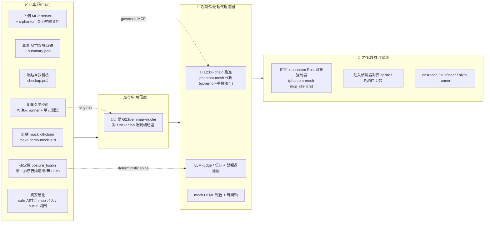

# phantom-secops — 唯一主文件

> 本檔為 phantom-secops 唯一主文件;設計／決策／訪談腳本／OSS 調查的英文細節與舊版見 `docs/_archive/`。
> 倫理憲章獨立保留於 [`/ETHICS.md`](../ETHICS.md)(法律界線單一真相來源,從本檔連結)。
> 對應狀態:階段 *Public Alpha*、**220 passing tests**、8 個引擎模組、7 個 MCP server、2 大支柱(紅藍 SOC 展示 + 端點自我健檢)。每個「已出貨」項都對應真實 commit。**G2(live nmap+nuclei 對 Docker lab 端到端)已於 2026-06-21 驗證通過**(見下方狀態表)。

## 目錄
- [定位與護城河](#定位與護城河)
- [快速上手](#快速上手)
- [狀態與視覺路線圖](#狀態與視覺路線圖)
- [開源生態與方向](#開源生態與方向)
- [刻意不做 / 倫理紅線 / over-build 風險](#刻意不做--倫理紅線--over-build-風險)

---

## 定位與護城河

**phantom-secops 是建構於作者自有多代理執行階段 [phantom-mesh](https://github.com/markl-a/phantom-mesh) 之上的資安維運專案,屬該生態系的一部分。** Python(3.10+),Apache-2.0。它做**兩件事**:

1. **紅藍隊 SOC 概念展示** — red(攻擊)與 blue(防禦)兩條代理管線並行對打一座隔離的易受攻擊實驗室,產出並列的 **平均偵測時間(MTTD)** 對照。
2. **本機優先的端點自我健檢** — 唯讀檢查*這台*機器:主機姿態、相依套件 CVE、主機入侵偵測,由一個確定性的 fusion 步驟合併、再由 LLM 代理統整成**單一、優先排序、白話**的行動清單。資料絕不離開本機。

### 護城河 = 唯讀 / 純文字 + 受治理 MCP 編排 + LLM 只當 triager,絕不當 exploiter

哲學一句話:**「不造引擎,造大腦」** —— 包裝成熟、久經沙場的資安工具(Trivy / Nmap / Nuclei / Sigma),讓 LLM 代理去**編排、關聯、解釋**;差異化在代理層,不在重寫掃描器。永久不變的界線(就是產品本身,不是限制):

- **唯讀 / 純文字輸出。** exploit-suggester 只吐**散文**(`has_runnable_poc` 永遠為 `false`);端點工具唯讀且僅限本機 —— 它**建議**,絕不改你的系統。
- **受治理的 MCP 編排。** 每個工具標上 `x-phantom.{classification, capabilities, read_only}` 能力中繼資料(如 `blue` / `read.host_posture` / `target.self_only`),這是 phantom-mesh 中 per-agent 政策執行器的掛鉤,也是每個工具廣告自己唯讀/自我作用域的方式。配合 phantom-mesh 的 governor + 手機核可平面。
- **LLM 只當解釋者 / 評審 / 分流者。** 仿效正式生產中真正奏效的模式(Semgrep Assistant、Corgea、Socket):確定性引擎找事實,LLM 做分級/排序/去重/白話化。確定性核心(`posture_fusion`)不含 LLM,作為可信任的脊椎。

兩支柱皆不宣稱生產級 SOC 自動化、0-day 發掘或第三方掃描。一切僅限實驗室或僅限本機,且唯讀。完整法律界線見 [`ETHICS.md`](../ETHICS.md)。

---

## 快速上手

### 展示一:紅藍 SOC 管線 + MTTD(≈2 分鐘,無 Docker、無 API key)

```bash
make demo-mock        # 或: python scenarios/run_kill_chain.py --target juice-shop --mock
```

紅隊(recon → vuln-scan → exploit-suggest → pentest-report)與藍隊(log-anomaly → triage → correlate → incident-report)在兩個都從 t=0 起跑的時鐘上並行推進。招牌指標:

```
→ MTTD = 15s  (simulated timing — mock mode)
  defender triaged the activity at t+15s; attacker reached impact at t+50s
  → detected 35s before impact
```

即「我們有沒有在攻擊造成衝擊**之前**偵測到,提早多久?」—— SOC 用來衡量自己的指標。mock 模式的時間是**模擬的**(輸出明確標 `simulated`;live 模式用真實 wall-clock)。真實的執行紀錄(機器可讀)寫到 `reports/runs/<ts>/`:`incident-report.md`(交錯時間軸 + ATT&CK 階段 + P1/P2/P3 佇列 + MTTD 拆解)、`pentest-report.md`(recon + 依嚴重度排序的發現 + **純散文**緩解建議)、`summary.json`(MTTD / outcome / detect_margin / time_to_impact + 排序時間軸,供圖表消費者)。

```bash
make lab-up && make demo && make lab-down   # live,對 Docker lab(端到端尚未驗證 — 見 G2)
```

### 展示二:本機端點自我健檢 + AI 分流(Windows)

```powershell
.\checkup.ps1                              # 一鍵:測試 + 每個工具 + 確定性 fusion + AI 報告
.\checkup.ps1 -Path D:\Projects\my-app     # 對指定專案掃 CVE
```

一次作者機台上的真實執行在某姊妹專案揭露了 **864 個可修復的 CVE** + 一個 AV 即時防護缺口,接著代理產出確切的升級版本與排序好的修復順序。Windows 排程工作可每日跑並記錄到 `reports/checkup/`。要展示一個 live true-positive:

```powershell
powershell -NoProfile -Command "Write-Output 'demo: Invoke-Mimikatz sekurlsa::logonpasswords'"
.\checkup.ps1 -SkipTests   # IDS 標記為 critical(mimikatz 指標);需開啟 Script Block Logging
```

### 工具總覽(端點支柱)

| 能力 | 引擎 | MCP 工具 |
|---|---|---|
| 主機姿態(防火牆 / 磁碟加密 / AV / UAC / ports / SIP) | 原生 OS 查詢 | `secops_host_audit` |
| 相依套件 / OS 套件 CVE(優先排序、可修復優先) | **Trivy** | `secops_vuln` |
| 主機入侵偵測(編碼 PowerShell、下載 cradle、AMSI bypass…) | 作用於 Windows 事件日誌的小型 **Sigma** 引擎 | `secops_ids` |
| 設定自我稽核(phantom-mesh `agents.toml` 衛生) | 原生 | `secops_self_audit` |
| 實驗室 recon / log-anomaly(支柱一工具,亦暴露) | nmap / pattern matcher | `secops_recon`、`secops_log` |

### 驗證

```bash
python -m pytest -q   # 全綠(202 passing),全經可注入 runner,測試中無真實掃描
```

涵蓋 matcher / parser / 優先排序 / Sigma 引擎 / elevation 與 encoding edge case。CI workflow 在 `.github/workflows/ci.yml`。

---

## 狀態與視覺路線圖

> 排序原則:① **便宜高值優先** ② **護城河優先於廣度**(唯讀/受治理立場與跨庫政策執行器是資產)③ 需真環境/真錢/操作者決策的**排後並標明** ④ 明列**刻意不做**。
> 每個「已出貨」項對應 `main` 上的真實 commit(測試數取自 commit `833919c` 的 202 passing)。圖例:✅ 已出貨 ｜ 🚧 進行中 ｜ 📅 近期 ｜ 🔭 之後 ｜ 🔴 高優先 ｜ 🧪 需真環境驗證 ｜ 👤 需操作者決策 ｜ ⛔ 倫理紅線。

### 狀態總覽(Mermaid)



### ✅ 已出貨(grounded,對應真實 commit)

| 項目 | 具體內容 | 對應 commit / 證據 |
|---|---|---|
| 紅藍 mock kill-chain | 確定性 mock kill-chain(`make demo-mock`),紅藍兩條並行時鐘,<1s、無 Docker、無 API key | `run_kill_chain.py` |
| 真實 MTTD | 雙時鐘 + 模擬 per-step 時長取代早先的 `0.0s`;mock 顯示 **MTTD 15s、提早 35s 偵測**,mock 模式誠實標 `simulated`,雙向誠實(防守贏/攻擊贏) | mock 兩時鐘模型 |
| 機器可讀指標 | 真實 run 寫 `summary.json`(MTTD / outcome / detect_margin / time_to_impact + 排序時間軸) | `aa8d67c` `833919c` |
| log_ingest 真接線 | `log_ingest.scan_window` 真正接入 orchestrator blue path(原為死碼),journalled 並併入 triage/correlate | `b937196` `b4d6855` |
| live-mode 誠實 | 缺 Docker/nmap/nuclei 時 live 模式顯示 **DEGRADED** banner 而非假綠;live `nmap` recon + 逐端點 `nuclei` 已在程式接好 | `7abe732` |
| 端點自我健檢 | 一鍵 `checkup.ps1`(工具鏈 + LLM 統整成單一優先報告);Windows 排程可每日跑 | `checkup.ps1` |
| 8 個引擎模組 | `host_audit` / `vuln_scan`(Trivy)/ `ids_scan`(Sigma)/ `log_anomaly` / `log_ingest` / `nmap_runner` / `nuclei_runner` / `posture_fusion`,各為可注入 runner 的純模組 | `tools/*.py` |
| 確定性 posture-fusion | `posture_fusion.fuse_posture` 把 host_audit+vuln_scan+ids_scan 合併為**單一排序行動清單**(正規化嚴重度、最高風險先、穩定 tiebreak、白話、**無 LLM**),接入真實 `checkup.ps1`("== PRIORITISED ACTIONS ==") | `3f76901` `f16e4ae` |
| 7 個 MCP server | `phantom_secops/mcp/` 下 `secops_host_audit` / `secops_ids` / `secops_log_ingest` / `secops_log` / `secops_recon` / `secops_self_audit` / `secops_vuln`;`make mesh-sync` / `mesh-mcp-config` 產出 agent/MCP config | `899d82a` |
| x-phantom 能力模型 | 每工具 `classification` / `capabilities` / `read_only` 中繼資料 —— per-agent 政策執行的掛鉤;每工具廣告唯讀 + 自我/實驗室作用域 | MCP wrapper |
| 資安硬化 | `eval()`→ 安全 AST 布林評估器(關 DoS/escape)、nmap shell-injection 修補、nuclei timeout 夾擠、IDS 條件長度上界(捕捉 RecursionError/MemoryError)、nuclei lab-gate 子字串繞過修為精確 hostname 比對;cp950 Windows encoding robustness;honest `unknown`(需 admin 的檢查回 `unknown` 不假 `fail`) | `d66bbb9` `9355710` `5ad9a81` `eb70350` `284c0c7` |

> 目前:**220 passing tests**、8 個引擎、7 個 MCP server、2 大支柱。

### ✅ G2 已關閉 — live 端到端已驗證(2026-06-21)

`make lab-up && python scenarios/run_kill_chain.py --target juice-shop` 對 Docker lab 跑出**乾淨、非-degraded 的 live run**(總時 ~79s:真實 `nmap` recon 抓到 port 3000 + 真實 `nuclei` 逐端點掃描跑完),藍隊並從**真實收集到的 lab log** 偵測到該掃描流量(`scanner_ua` 命中 nmap/nuclei)。修掉了一批只有真實環境才會現形的 bug:

| 真實環境揭露的問題 | 修法 |
|---|---|
| `docker-compose.yml` 的 attacker 服務從未引用 `Dockerfile.attacker` → 容器內**沒有 nuclei**(舊 inline `apt-get` 只裝 nmap),live nuclei 路徑從來跑不成 | compose attacker 改為 `build: Dockerfile.attacker`(預烤 nuclei 3.3.5 + templates) |
| `nuclei_runner` 把 nuclei 的 `-timeout`(**每請求**連線逾時)誤設為整體 wall-clock 預算 → 每個慢請求 hang 滿整個預算,掃描永遠跑不完、被中途砍掉誤報 0 findings | 拆出獨立的 `request_timeout_s`(預設 10s),`timeout_s` 僅作 subprocess wall-clock 上限 |
| 天真的全目錄/`info` 掃描對 juice-shop(SPA 對任何路徑都回 200)產生 ~58k 假陽性,違反原則 4 | live 路徑收斂到 `severity=high,critical`(有界 ~1 分鐘、高訊號、低假陽性) |
| DEGRADED banner 的 `⚠` 在 Windows cp950 console 崩潰(UnicodeEncodeError) | `main()` 啟動時把 stdout/stderr reconfigure 為 UTF-8 |
| juice-shop 是 distroless node 映像(無 sh/wget)→ wget 健康檢查永遠失敗,`make lab-up` 誤報逾時 | 健康檢查改用映像內的 `node` runtime + `start_period` |

> 誠實註記:這些 lab app 的漏洞是**應用邏輯型(OWASP 挑戰)**,非 nuclei 可指紋偵測的 CVE,所以 high/critical 誠實地是 0 findings;豐富的偵測訊號來自藍隊(IDS/log-anomaly)與端點 posture 支柱,不是 nuclei。

| 目標 | 具體項 | 風險 / 前置 |
|---|---|---|
| 維持唯讀不變式 | 在測試中斷言 `has_runnable_poc == false` 為永久不變式 | 低;純測試 |

### 📅 近期 — 受治理的代理迴圈(Pillar 1 L2)

| 目標 | 具體項 | 在哪做 | 風險 / 前置 |
|---|---|---|---|
| 👤 **把 kill-chain 跑進 phantom-mesh 代理** | 今日由確定性 Python orchestrator(`scenarios/run_kill_chain.py`)驅動;改由代理迴圈驅動,**外包 governor + 手機核可**(設計見 `docs/_archive/L2-INTEGRATION-PLAN.md`;其 `secops_mcp/` façade **尚未建**) | `z13` + `claude` 編排;`codex` 寫 façade | 👤 需確認治理界線;前置 = G2 的 live 路徑可信 |
| 用 `x-phantom` 真正擋工具 | blue 代理被拒用 red 工具(能力模型從「廣告」變「強制」) | `z13` + `codex`;`opencode` 對讀 MCP 中繼資料 | MCP 本身是攻擊面(工具下毒/越權),強制需可靠 |
| LLM-judge / triage 層 | 在 fused 發現上加信心分數 + 誤報過濾 judge(對齊 Semgrep Assistant / Corgea「引擎找事實、LLM 分級」);`posture_fusion` 確定性核心保持不變 | `z13` + `claude` 設計 prompt;`codex` 實作;`agy`/`opencode` 雙閘 | 須守住「確定性脊椎」不被 LLM 取代 |
| 視覺化 | mock 跑出 HTML 報告 + 時間軸(供圖表消費者) | `acer` 或 `z13` + `codex` | 低;純展示層 |

### 🔭 之後 — 跨庫政策強制器 + 注入分類對齊(護城河兌現)

| 目標 | 具體項 | 在哪做 | 風險 / 前置 |
|---|---|---|---|
| 🛡️ **跨庫 `x-phantom` 強制器** | 在 phantom-mesh `mcp_client.rs` 落地 Rust 政策強制器(把 phantom-secops 從展示變成「任何 MCP 資安工具都能用的治理範式」) | `z13`(Rust 主庫)+ `claude` 編排;`codex` 寫 Rust;`agy` review | 跨庫;需 phantom-mesh 端協調。**這就是利基** |
| 對齊業界分類 | 注入偵測器規則對齊 garak / PyRIT 分類(**引用不重造**) | `z13` + `opencode` 查分類 → `codex` 套用 | 低;引用既有 taxonomy |
| 補概念 runner | `dnsrecon` / `subfinder` / `nikto`(目前只在圖中;nikto 已裝在 lab image 未被呼叫);LLM-written exploit prose(`--use-llm` 目前是 stub)+ 對本機 NVD 紀錄做 CVE grounding | `acer` + `codex` | 需 lab 環境;優先級低於護城河 |

---

## 開源生態與方向

> 研究筆記,撰寫於 2026-06-19。每項外部宣稱皆奠基於一個已擷取來源(URL 內嵌);無法獨立驗證者標 `[UNVERIFIED]`。星數為時間點快照、會變動,視為數量級。本節為決策輔助,非規格;專案狀態以上方〈狀態與視覺路線圖〉為準。
>
> **核心論點:** 成為**受治理、可稽核、MCP 原生的編排 + 分流 + LLM-judge 層,疊加於標準資安工具之上** —— 一個防禦/教育用途的「大腦」,**而非**另一個自主漏洞利用者。順勢切入眾人忽略的藍隊 + 端點衛生賽道,並讓**治理**(phantom-mesh governor + 手機核可 + `x-phantom` 能力政策)成為攻擊性 MCP 套件全都欠缺的差異化關鍵。

### 2.1 AI-agent 滲透測試 / 攻擊性資安(擁擠的戰場)

| 專案 | 它是什麼 | URL | 星數 / 成熟度 | 授權 | 是否執行? |
|---|---|---|---|---|---|
| **PentestGPT** | LLM 引導的滲透測試助手(USENIX Security 2024)。本類型種子。 | https://github.com/GreyDGL/PentestGPT | 成熟、廣受引用 | 依 repo | 引導人類(半互動) |
| **CAI**(Alias Robotics) | 攻+防自動化 ReAct 框架;300+ 模型;HITL。 | https://github.com/aliasrobotics/CAI | ~9.2k★,非常活躍 | Apache-2.0 / MIT | **是 —— 會執行** |
| **Strix**(usestrix) | 動態執行程式碼、找漏洞、**以真實 PoC 驗證**的自主代理。 | https://github.com/usestrix/strix | ~26k★,成熟 | Apache-2.0 | **是 —— 會執行 PoC** |
| **PentAGI**(vxcontrol) | Docker sandbox 內完全自主的多代理滲透系統。 | https://github.com/vxcontrol/pentagi | ~14.7k★ `[UNVERIFIED]` | 依 repo | **是 —— 自主** |
| **XBOW**(商業) | 自主 web「AI hacker」;HackerOne 排行榜 #1(2026-04)。 | https://xbow.com | 商業 | proprietary | **是 —— 完整利用** |
| **Google Big Sleep** / **OpenAI Aardvark** | 前沿實驗室 LLM 代理,真實 0-day 發掘(CVE-2025-6965 等)/ 監看 commit 並提修補。 | [Google](https://blog.google/innovation-and-ai/technology/safety-security/cybersecurity-updates-summer-2025/) · [OpenAI](https://openai.com/index/introducing-aardvark/) | 前沿研究 | proprietary | **是 —— 真實 0-day** |

**結論:** 開源攻擊性代理領域龐大、資金充裕,正競相奔向*完全自主漏洞利用*;前沿實驗室掌握真實 0-day 前線。**phantom-secops 無法也不該在此競爭** —— 它已明確劃出可執行 exploit 之外。那是特性,不是缺陷。

### 2.2 漏洞偵測 / 程式掃描的 AI(LLM-SAST、fuzzing)

| 專案 | 它是什麼 | URL | 授權 |
|---|---|---|---|
| **Vulnhuntr**(Protect AI) | LLM + 靜態分析追完整呼叫鏈;發現過真實 0-day。 | https://github.com/protectai/vulnhuntr | **AGPL-3.0** |
| **Semgrep + Assistant** | 開源 SAST 引擎 + AI 分流/修補建議/雜訊過濾層。 | https://github.com/semgrep/semgrep | LGPL-2.1(引擎) |
| **Corgea** / **Socket** | AI 原生 AppSec(掃+分流+修補,提供 Agent Skill)/ 供應鏈 SCA + 惡意套件 AI 偵測。 | https://corgea.com · https://github.com/SocketDev/socket-basics | proprietary / 依 repo |
| **OSS-Fuzz-Gen**(Google) | OSS-Fuzz 之上以 LLM 生成 fuzz driver;發現 26+ 新漏洞。 | https://github.com/google/oss-fuzz | Apache-2.0 |

**結論:** 正式生產中*奏效*的反覆模式 = **在確定性引擎之上以 AI 作分流/解釋**(Semgrep Assistant、Corgea、Socket)。這正是 phantom-secops 的 `posture_fusion` + LLM 報告設計 —— 站在趨勢的正確一側,而非自主發掘那側。

### 2.3 AI + 傳統資安工具編排(MCP 原生)

| 專案 | 它是什麼 | URL | 授權 |
|---|---|---|---|
| **mcp-for-security**(cyproxio) | 26 個資安工具(Nmap/Nuclei/SQLmap/FFUF…)作為 MCP server。 | https://github.com/cyproxio/mcp-for-security | MIT;**2026-03-30 已封存** |
| **mcp-security-hub**(FuzzingLabs) | 攻擊性工具(Nmap/Ghidra/Nuclei/SQLMap/Hashcat)作 MCP server。 | https://github.com/FuzzingLabs/mcp-security-hub | 依 repo |
| **awesome-mcp-security**(Puliczek) | 精選 MCP 資安工具索引 **+** MCP 協定資安風險。 | https://github.com/Puliczek/awesome-mcp-security | 清單 |

**結論:** 此領域正收斂於**將 MCP 作為資安工具整合基底** —— 正是 phantom-secops 的架構。但既有套件幾乎全是**攻擊性且未受治理**(把原始 Nmap/SQLMap 暴露給沒有政策模型的代理),其中領先者已*封存*。**缺口在於治理 + 能力/政策模型 + 唯讀立場** —— 恰恰是 `x-phantom` + phantom-mesh governor/手機核可。

### 2.4 LLM 紅隊 / 模型安全(與注入偵測器相鄰)+ 防禦/藍隊

| 專案 | 它是什麼 | URL | 授權 |
|---|---|---|---|
| **garak**(NVIDIA) | LLM 漏洞掃描器;120+ 探針(prompt injection / jailbreak / 洩漏)。 | https://github.com/NVIDIA/garak | Apache-2.0 |
| **PyRIT**(Microsoft) | 多輪對抗式攻擊編排框架。 | https://github.com/Azure/PyRIT | MIT |
| **promptfoo** | 評估 + 紅隊工具;2026-03 被 OpenAI 收購,維持 MIT。 | https://github.com/promptfoo/promptfoo | MIT |

**結論:** phantom-secops 已有注入偵測器;這些是標準參考 —— *引用其分類*(garak/PyRIT taxonomy),別重造探針庫。另:**開源*藍隊* agent 顯著比攻擊側稀薄**(多為示範級;最成熟藍隊自動化是傳統非 AI 的 Sigma/Wazuh/Elastic)。**這就是那條開放賽道** —— phantom-secops 的藍隊支柱(Sigma IDS、log-anomaly、確定性 posture-fusion、MTTD、白話優先報告)處在一個比攻擊性淘金熱更不擁擠、更具防禦性的利基。

### 務實的分階段路徑

1. **Phase 0 — 可信度(現在)。** 關 G2:對 Docker lab 端到端驗證真實 `nmap`+`nuclei`;斷言 `has_runnable_poc == false` 不變量。*不增添新範圍。*
2. **Phase 1 — 受治理的代理迴圈(Pillar 1 L2)。** 透過 phantom-mesh 代理迴圈驅動紅/藍 kill-chain,**由 governor + 手機核可包裝**,並以 `x-phantom` 對藍隊代理執行紅隊工具拒絕。別人都沒有的示範:*會徵求許可的 agentic 資安。*
3. **Phase 2 — LLM-judge / 分流層。** 在融合發現上加信心 + 假陽性過濾 judge(Semgrep-Assistant 模式),底層維持 `posture_fusion` 確定性。可選 HTML 報告 + 時間軸。
4. **Phase 3 — 跨庫政策執行器 + 注入分類對齊。** 在 phantom-mesh `mcp_client.rs` 落地 `x-phantom` Rust 執行器;對齊 garak/PyRIT。把 phantom-secops 從示範轉為**可重用的、適用於任何 MCP 資安工具的治理模式**。

### 最值得追蹤 / 對照的開源(短名單)

1. **CAI** — https://github.com/aliasrobotics/CAI — 同具攻防模式 + HITL 的開源參考標竿;哲學上最近的鄰居(但它會執行;phantom-secops 刻意不執行)。
2. **Strix** — https://github.com/usestrix/strix — 帶真實 PoC 的自主滲透標竿;phantom-secops 明確**不是**的那種,定位最佳對照。
3. **cyproxio/mcp-for-security** — https://github.com/cyproxio/mcp-for-security — 那個(現已封存)通用資安 MCP 套件;證明了基底,暴露了 phantom-secops 所填補的治理缺口。
4. **Semgrep + Assistant** — https://github.com/semgrep/semgrep — 經生產驗證的「確定性引擎 + AI 分流」模式,應仿效。
5. **Vulnhuntr** — https://github.com/protectai/vulnhuntr — 可信開源 LLM-SAST 參考(AGPL —— **僅參考,別 vendor**)。
6. **garak / PyRIT** — https://github.com/NVIDIA/garak · https://github.com/Azure/PyRIT — 注入偵測器賽道的標準 LLM 紅隊參考。

---

## 刻意不做 / 倫理紅線 / over-build 風險

> 這些是**永久界線,不是未來工作**(法律界線完整版見 [`ETHICS.md`](../ETHICS.md);工程決策見下方〈附:關鍵工程決策〉與 `docs/_archive/DECISIONS.md`)。任何要加入下列項目的 PR,依憲章視為 out-of-scope。

| ⛔ 紅線 | 為什麼不做 |
|---|---|
| ⛔ **不加可執行 PoC / exploit** | `has_runnable_poc` 永遠為 `false`,suggester 只吐**散文**。違反唯讀/純文字憲章;且踩 CFAA / 刑法第 358-363 條 / 授權法律風險。這條線**就是產品**,不是限制。 |
| ⛔ **不做外部掃描** | lab 目標在 localhost / Docker overlay 以外全數**拒絕清單**;端點工具唯讀且僅限本機。對外掃描 = 法律風險 + 失去利基。 |
| ⛔ **不自動修復(auto-remediation)** | 每個工具只**建議**,絕不改你的系統。保持低信任/低責任門檻;誤改即災難。直到有 human-in-the-loop 核可模型前,使用者自己動手才是對的界線。 |
| ⛔ **不漂向自主化(autonomy drift)** | OSS 攻擊代理(Strix 26k★、CAI 9.2k★、PentAGI 14.7k★)全在衝「全自主 exploit」。每往那走一步就**抹掉**本專案利基、**加上**法律面。不追「自主 pentester」。 |
| ⛔ **不蹭「自主找 0-day」頭條** | Big Sleep / OSS-Fuzz-Gen / XBOW 是**前沿實驗室 + 重算力**結果,不是單人 Apache 專案該設的目標。誠實設定期待(README/ROADMAP 已做得好,維持下去)。 |
| ⛔ **不重造掃描引擎** | 包裝 Trivy / Nmap / Nuclei / Sigma 當引擎即可;不重寫 scanner。 |
| ⚠️ **AGPL Vulnhuntr 只參考、不 vendor** | 本庫 Apache-2.0;Vulnhuntr 是 **AGPL-3.0**。可引用思路,**不可** vendor / 衍生其程式碼,否則授權立場破功。 |
| ⚠️ **MTTD / demo 數字在 mock 模式須標「simulated」** | 已落實。這份誠實是相對於市場過度宣稱端的可信度護城河。 |
| ⚠️ **MCP 本身是攻擊面** | 工具下毒、過寬能力、注入工具呼叫的 prompt injection 是有文獻記載的風險(見 awesome-mcp-security)。`x-phantom` + governor 必須被**執行**,而非僅供參考。 |

### 該建 / 不該建(差異化邊界)

| 決策 | 項目 |
|---|---|
| ✅ **包裝為引擎(已做 / 續用)** | Trivy(CVE)、Nmap、Nuclei、Sigma(偵測規則)。候選方向:garak / promptfoo / PyRIT 作為注入偵測器的**選用** LLM-red-team 檢查。 |
| 📖 **只引用 / 致敬(不建)** | Vulnhuntr(AGPL,僅參考)/ Big Sleep / Aardvark / OSS-Fuzz-Gen(前沿 0-day 發掘,明確 out-of-scope);Semgrep Assistant、Corgea、Socket 作為「引擎 + AI triage」先例佐證設計。 |
| 🛠️ **要建(差異化部分)** | ① 跨庫 `x-phantom` 政策強制器;② findings 上的 LLM-judge / 信心 + 誤報過濾層;③ posture-fusion 深化;④ 受 governor + 手機核可包裹的代理迴圈(Pillar 1 L2),非放任自走。 |

**最大風險 = 在競爭壓力下漂向自主性。** 此領域的引力是「讓它自主、讓它去利用漏洞」;每一步往那走都*抹除*利基並*增添*法律/責任面。唯讀/純文字/僅限自身或實驗室這條線就是產品本身。各 `[UNVERIFIED]` 標記在對外引用前皆應對照活躍來源確認。

---

### 附:關鍵工程決策(摘要;完整 9 條見 `docs/_archive/DECISIONS.md`)

- **不造引擎、包裝引擎並以代理編排** —— 久遠差異化在「大腦」(triage/關聯/白話修復),非重寫引擎。
- **可注入命令 runner** —— OS-touching 程式以預製輸出單元測試,測試中零真實掃描。
- **低假陽性優先於覆蓋率** —— 曾把一個對*簽章的 Microsoft 模組 manifest* 誤報的 IDS 規則收緊(800 事件 0 雜訊);刻意**不**堆 300+ CIS 檢查(對個人機是 alert-fatigue 雜訊)。
- **誠實降級,絕不假警報** —— 需 admin 的檢查回 `unknown` + 「以系統管理員重跑」提示,不假 `fail`。
- **feed-don't-rescan** —— 把確定性發現一次餵給代理(別讓它重掃);修掉了「代理重掃逾時誤報無發現、log 卻有 864」的 bug。
- **唯讀設計** —— 建議與解釋,絕不改系統。
- **Provider 現實** —— 主用 Cerebras `gpt-oss-120b`(快、免費額度大、tool call 不迴圈)+ Groq/Gemini fallback;key 僅以 `api_key_env` 引用,絕不內聯。
- **分清「能力證明」與「我每天用的工具」** —— lab demo 證 SOC 概念理解、端點工具證真實工程,兩者並存不互相扭曲。

> 架構分層、多代理理由、`x-phantom` 模型、訪談腳本與 demo 走查的完整英文版,見 `docs/_archive/`(ARCHITECTURE / DECISIONS / DEMO / INTERVIEW-TALK-TRACK / L2-INTEGRATION-PLAN / OSS-LANDSCAPE-AND-DIRECTION / INDEX)。
